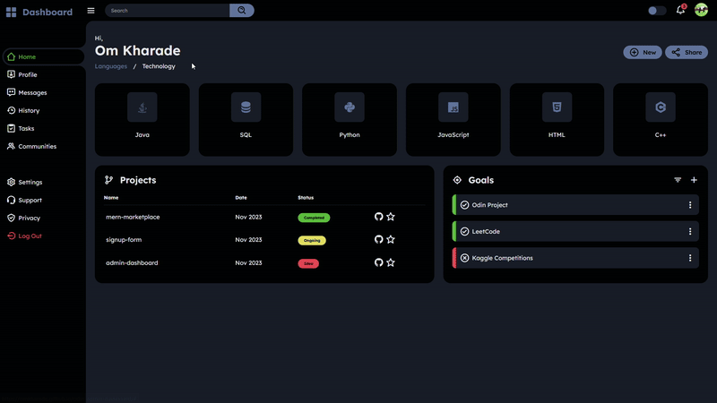

# Dashboard

## Overview
Dashboard is a project developed as part of [The Odin Project](https://www.theodinproject.com/).  It includes advanced CSS for theming and responsive behavior, making it adaptable to different screen sizes.

## Features
- Dynamic Theme Toggle: Switch between light and dark themes with a simple toggle button.
- JavaScript Functionality: Enhances user experience with features like active state management, responsive menu handling, and theme toggling.
- Responsive Design: Automatically adjusts to different screen sizes, providing a consistent user experience on both desktop and mobile devices.

## Live Demo
Check out the live demo of the project [here](https://omkharade.github.io/odin-admin-dashboard/)

## Credits

- Project guided by [The Odin Project](https://www.theodinproject.com/)
- Icons used in this project are provided by [Boxicons](https://boxicons.com/)
- Theme toggling was learnt from [this video](https://www.youtube.com/watch?v=CkVrmLLHmuI&pp=ygUYYWRtaW4gZGFzaGJvYXJkIGh0bWwgY3Nz)

## More projects
[Here](https://github.com/OmKharade/odin-tictactoe) is what I worked on after this.

#### Visit my [GitHub Profile](https://github.com/OmKharade). Your feedback and support are always appreciated.